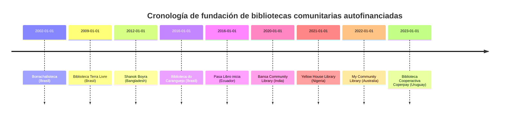

# Casos de éxito de bibliotecas comunitarias autofinanciadas

## Resumen Ejecutivo  
La investigación documenta **10 casos globales** de bibliotecas comunitarias y autofinanciadas con modelos diversos (cooperativas, empresas sociales, microemprendimientos, alianzas público-privadas, membresías, eventos culturales, venta de servicios). Los casos provienen de **América Latina (Brasil, Ecuador, Uruguay)**, **Asia (India, Bangladesh)**, **África (Nigeria)** y **Oceanía (Australia)**. Cada caso incluye datos de fundación, financiamiento inicial y actual, gobernanza, servicios, tamaño de colección, recursos humanos, presupuesto, indicadores de impacto, desafíos y lecciones. 

- En **Brasil** destacan proyectos como la *Borrachalioteca* (Sabará, 2002), integrada a un taller de llantas, con +20.000 libros en colección y gestión convertida en ONG; la *Biblioteca Terra Livre* (São Paulo, 2009), autogestionada por un colectivo anarquista y autofinanciada mediante una editorial propia; y la *Biblioteca do Caranguejo* (Raposa, 2016), iniciativa pesquera autónoma sin apoyo externo.  
- En **Ecuador**, el proyecto *Pasa Libro* (desde ~2016) liderado por Nubia Sandoval creó bibliotecas en Zaruma, Durán, Guayaquil, Chongón, Olón y Ayampe, sostenidas “principalmente a través de la autogestión” comunitaria, con actividades culturales (círculos de lectura, talleres, cine) y cerca de 5.000 libros en rotación.  
- En **Uruguay**, la *Biblioteca Cooperactiva de Coperpay* (Paysandú, 2023) fue impulsada por una cooperativa de consumo que destina su sede y recursos al servicio. El espacio de 20 m² alberga textos de cooperativismo y literatura recreativa, y se apoya en una alianza con la universidad local (sistema informático).  
- En **Nigeria**, la *Yellow House Library* (Yenagoa, 2021) surgió para alfabetizar a niños pescadores. Fundada por un activista con el legado bibliográfico de su padre, atiende gratis todos los fines de semana a >60 niños regulares, combinando espacio seguro y clubes de lectura.  
- En **Bangladesh**, la *Shanok Boyra Anusandhan Library* (Tangail, 2012) comenzó en la vivienda del fundador, con apoyo de la red *Village Library Movement*. A pesar de no tener fondos propios (colección <100 libros donados), opera con ~200 miembros y eventos anuales de fomento lector.  
- En **India**, la *Bansa Community Library* (Hardoi, 2020) construyó dos salas en terreno de un templo. Financiada por donaciones de libros y dinero, alcanzó ~2.100 miembros y ~100 visitas diarias, ofreciendo aulas de apoyo y recursos gratuitos.  
- En **Australia**, la *My Community Library* (Melbourne, 2022) transformó un consorcio municipal en NPO autofinanciada. Esta red de bibliotecas públicas (antes sustentada por concejos locales) migró a un modelo mixto (membresías, patrocinio) para ampliar servicios regionales.  

En conjunto, estos casos muestran que las bibliotecas comunitarias pueden sostenerse con recursos locales (donaciones, actividades, ventas simbólicas, cooperación institucional) y fuertes redes de voluntariado, aunque enfrentan retos de financiamiento y formalización. Se elaboraron **tablas comparativas** (atributos clave) y una **matriz de replicabilidad** por contexto socioeconómico. Además, se incluyen diagramas mermaid ilustrativos (cronología y flujo de replicación).

## Casos destacados

### Borrachalioteca (Sabará, Brasil, 2002)  
- **Origen / Fundación:** Inició en 2002 dentro de un taller de reparación de llantas (sobrenombre *borracharioteca*). El taller integró libros junto con el servicio mecánico.  
- **Financiamiento inicial:** Prácticamente autogestión del emprendedor (taller mecánico familiar).  
- **Modelo de autofinanciamiento actual:** Convertido en ONG en 2006 (Instituto Cultural Aníbal Machado) con apoyo de donaciones puntuales y subvenciones de programas (Instituto C&A, RNBC).  
- **Gobernanza:** Organización sin ánimo de lucro dirigida por el fundador y voluntarios. En 2011 fue declarado Punto de Cultura regional.  
- **Servicios:** Préstamo domiciliario de libros (15 días), club de lectura, actividades culturales.  
- **Tamaño de colección:** >20.000 obras en buen estado, catalogadas manualmente.  
- **Personal / Voluntariado:** Equipo esencialmente voluntario (el personal remunerado es mínimo o nulo).  
- **Presupuesto anual estimado:** **No especificado**. Se financia con donaciones y premios (recibió el premio “Viva Leitura” 2007).  
- **Impacto/Sostenibilidad:** Reconocimiento cultural regional; satisface necesidad local de acceso a libros. Su uso diario refleja compromiso comunitario.  
- **Desafíos:** Conseguir financiamiento estable es “el mayor reto”. Depende de alianzas y subvenciones intermitentes.  
- **Lecciones aprendidas:** Integrar biblioteca en un negocio (taller) permitió un inicio creativo. Convertir la iniciativa en ONG formalizó la gestión. Recomendable replicar la idea de *hospedar* pequeñas bibliotecas en locales de negocios comunitarios.

### Biblioteca Terra Livre (São Paulo, Brasil, 2009)  
- **Origen / Fundación:** Surge en 2009 tras reestructurar un colectivo anarquista que editaba la revista *Protesta!*. Establecida en un local propio en el barrio Pompeia, São Paulo.  
- **Financiamiento inicial:** Autogestión colectiva (no hubo donativos externos importantes).  
- **Modelo de autofinanciamiento actual:** Completamente autofinanciada. En 2011 creó una actividad editorial para recaudar fondos.  
- **Gobernanza:** Dirigida por un colectivo autónomo de militantes libertarios (estructura horizontal, sin jerarquía formal).  
- **Servicios:** Debate, cineclub, conferencias, ferias anarquistas – todas actividades gratuitas y abiertas. Biblioteca de materiales (libros, periódicos, revistas, música, cine) anarquistas (mucha publicación propia).  
- **Tamaño de colección:** **No especificado** (colección autogestionada de literatura y documentos libertarios).  
- **Personal / Voluntariado:** Equipo de voluntarios/as apasionados por la ideología anarquista.  
- **Presupuesto anual estimado:** **No especificado**. Principales ingresos de la editorial colectiva y aportes voluntarios.  
- **Impacto/Sostenibilidad:** Centro de referencia para movimientos sociales; atrae activistas internacionales (Charlas con invitados de varios países). Difunde pensamiento crítico.  
- **Desafíos:** Opera “sin ningún apoyo institucional”, lo que obliga a mantener la autogestión en un contexto hostil. Depende de la solidaridad comunitaria.  
- **Lecciones aprendidas:** El financiamiento creativo (editorial propia) es clave. El modelo de colectivo anarquista demuestra que una estructura no jerárquica puede sostener bibliotecas culturales radicales. Recomendable para grupos ideológicos: construir comunidad antes de buscar fondos.

### Biblioteca do Caranguejo (Praia do Mangue Seco, Raposa – Maranhão, Brasil, 2016)  
- **Origen / Fundación:** Iniciativa comunitaria nacida en 2016 de la cooperativa de pescadores local (Dona Luzia y Jackson Roger, líder comunitario).  
- **Financiamiento inicial:** Nació con recursos propios de los pescadores y donaciones de la comunidad.  
- **Modelo de autofinanciamiento actual:** Operación **autónoma**, sin depender de apoyos gubernamentales o empresariales. Se mantiene con voluntariado y colaboración de socios locales.  
- **Gobernanza:** Coordinador local (Jackson) y voluntarios de la comunidad de pescadores.  
- **Servicios:** Servicios sociales mixtos: biblioteca de préstamo de libros, talleres (crochet, guitarra), clases de educación ambiental y ambientales, actividades en fechas conmemorativas. Punto de encuentro comunitario en la playa.  
- **Tamaño de colección:** **No especificado** (colección modesta adaptada a niños y adultos locales).  
- **Personal / Voluntariado:** Voluntariado local (pescadores y vecinos apoyan permanente).  
- **Presupuesto anual estimado:** **No especificado**. Fondos propios mínimos; actividades gratuitas.  
- **Impacto/Sostenibilidad:** Punto cultural en región rural; fortalece identidad local pescadora. Ha logrado atraer a diversos grupos de edad a espacios de aprendizaje.  
- **Desafíos:** Falta de financiamiento estable – “no recibe ningún apoyo financiero…y aún así realiza acciones sociales”. Depende de la voluntad comunitaria y la resiliencia de los voluntarios.  
- **Lecciones aprendidas:** Demuestra que comunidades rurales pueden crear bibliotecas en espacios informales (arena de playa). El modelo “guardar libros entre pescadores” es replicable en comunidades con oficios afines (montañeses, mineros) donde un centro local sirve también para educación ambiental y social.

### Pasa Libro (Ecuador, ~2016)  
- **Origen / Fundación:** Proyecto iniciado por Nubia Sandoval hace ~10 años para llevar lectura a comunidades costeras con acceso escaso a cultura. Se instaló progresivamente en Zaruma, Durán, Guayaquil, Chongón, Olón y Ayampe, usando espacios cedidos (casas comunales, etc.).  
- **Financiamiento inicial:** Comenzó con recursos propios de la fundadora y donaciones de libros.  
- **Modelo de autofinanciamiento actual:** *Autogestión pura*: desde su inicio se sustenta “a través de la autogestión” comunitaria. Las cooperativas locales (como C. Unión de Bananeros en Guayaquil Sur) brindaron respaldo logístico inicial, pero luego la comunidad asumió costos básicos.  
- **Gobernanza:** Fundación/ONG dirigida por Nubia, con consejos locales y promotores de lectura voluntarios en cada sede.  
- **Servicios:** Préstamo gratuito de libros (infantil y adulto), círculos de lectura, talleres de literatura, proyecciones de cine y espacios de diálogo. Colaboración con escuelas para integración educativa.  
- **Tamaño de colección:** ~5.000 libros disponibles para nuevas sedes; colección en constante donación.  
- **Personal / Voluntariado:** Voluntarios locales (vecinos, docentes, estudiantes) organizan la biblioteca y dinamizan actividades. La propia comunidad “se apropia” del espacio.  
- **Presupuesto anual estimado:** **No especificado.** Su financiamiento es no monetario: donaciones de libros y aportes informales de empresas sociales (Ipso Facto es uno de los primeros aliados privados clave).  
- **Impacto/Sostenibilidad:** Miles de beneficiarios: unos 300 lectores registrados (préstamos frecuentes). Reconocido nacionalmente; el apoyo empresarial reciente demuestra su relevancia social.  
- **Desafíos:** Ausencia de apoyo público directo: la sostenibilidad depende de creatividad (eventos solidarios, alianzas estratégicas). Escalar la red requiere nuevas alianzas para alojar los ~5.000 libros sin uso.  
- **Lecciones aprendidas:** Validó que la *lectura comunitaria gratuita* puede arraigar con mínima infraestructura (un cubículo reacondicionado). Replicable en entornos urbanos marginales usando voluntariado y donaciones, siempre que se garantice “espacio propio” comunitario y compromiso vecinal.

### Biblioteca Cooperactiva Coperpay (Paysandú, Uruguay, 2023)  
- **Origen / Fundación:** Cooperativa de consumo Coperpay (Paysandú) decidió en 2022 crear una biblioteca temática. Inaugurada el 1 julio 2023 en local propio de la cooperativa (Sarandí y Setembrino Pereda).  
- **Financiamiento inicial:** Fondos de la cooperativa Coperpay y mano de obra voluntaria de socios. Proyecto de extensión universitaria contribuyó con gestión bibliotecaria (software).  
- **Modelo de autofinanciamiento actual:** Inserta la biblioteca dentro del objeto social de la cooperativa. Los costos operativos (internet, mantenimiento) son asumidos por la cooperativa. Se plantea ofrecer actividades culturales para captar fondos (futuros eventos, cursos).  
- **Gobernanza:** Comité directivo de la cooperativa designó responsables de la biblioteca. Colabora personal de Coperpay y estudiantes universitarios para gestión de acervo.  
- **Servicios:** Préstamo de libros sobre cooperativismo y lecturas recreativas para niños y adultos. Espacio multifuncional: estudio, recreación, actividades formativas. Se proyecta transformación en centro cultural con actividades varias (conferencias, ciclos).  
- **Tamaño de colección:** *Módico* (~centena de títulos iniciales) especializado en cooperativismo y educación, proveniente de donaciones de socios.  
- **Personal / Voluntariado:** Operado por voluntarios de la cooperativa y estudiantes en práctica (Bibliotecología). No tiene personal remunerado dedicado.  
- **Presupuesto anual estimado:** **No especificado**. Actualmente integración voluntaria; gastos mínimos cubiertos por la cooperativa (electricidad, equipamiento). Recibió apoyo tecnológico de U. República (servidor, software).  
- **Impacto/Sostenibilidad:** Mejora vínculos coop-comunidad; compensa carencia cultural local. Como caso piloto en consorcio público-privado, el proyecto potencia el rol social de las cooperativas.  
- **Desafíos:** Inicialmente enfocada en cooperativismo, necesita diversificar su acervo para mayor interés general. A futuro, depende de donaciones constantes y actividades recaudatorias para expandir.  
- **Lecciones aprendidas:** Integra modelo cooperativo con biblioteca, replicable en otras cooperativas de consumo u obreras. La alianza con universidad ejemplifica cómo instituciones pueden aportar recursos (software, asesoría) para viabilizar bibliotecas autogestionadas.

### Yellow House Community Library (Yenagoa, Nigeria, 2021)  
- **Origen / Fundación:** Creada en 2021 por Babawale Babafemi (activista/local) con libros heredados de su padre (antiguo director escolar). Enfatiza apoyar a los niños que abandonan la escuela por pobreza en comunidades pesqueras.  
- **Financiamiento inicial:** Capital social del fundador (donación de colección personal) y de la comunidad local (donativos iniciales de vecinos).  
- **Modelo de autofinanciamiento actual:** Biblioteca comunitaria sin cobro alguno, sostenida íntegramente por iniciativas locales (voluntariado y ayudas puntuales).  
- **Gobernanza:** Liderazgo del fundador junto a voluntarios de la comunidad. Estructura informal, no depende de ONG ni del gobierno.  
- **Servicios:** Programa de lectura de fin de semana: niños se agrupan y eligen libros para leer semanalmente. Mantiene jornadas lúdicas y de estudio para leer en grupo (motores de discusión). Abre sábados y domingos.  
- **Tamaño de colección:** Colección moderada (no especificada exacta, parte heredada y donada) centrada en literatura infantil y juvenil.  
- **Personal / Voluntariado:** Voluntariado interno (comunitarios que apadrinan las jornadas). Sin personal contratado.  
- **Presupuesto anual estimado:** **No especificado**. Opera completamente con recursos no monetarios (donaciones de libros, suministros).  
- **Impacto/Sostenibilidad:** En poco tiempo se estableció como “lugar de refugio” para niños no escolarizados; >60 niños asisten regularmente. Ha sido destacado en medios, demostrando el valor de bibliotecas en zonas empobrecidas.  
- **Desafíos:** Competencia con trabajo infantil y migración: mantener la asistencia constante pese al compromiso laboral de las familias de los niños. Carece de ingresos propios, por lo que depende de la voluntad comunitaria.  
- **Lecciones aprendidas:** Muestra que aún en contextos de extrema pobreza, una biblioteca informal puede motivar la lectura cuando ofrece espacio seguro. Su replicabilidad exige un líder local carismático y la capacidad de convertir un lugar (aun bajo una lona) en centro educativo.

### Shanok Boyra Anusandhan Library (Bhuiyapur, Tangail – Bangladesh, 2012)  
- **Origen / Fundación:** Iniciada en abril 2012 por Humayun Kabir en su dormitorio, inspirado por el primer club de libros de la aldea. Apoyada por la red *Village Library Movement* (VLM) de Bangladesh.  
- **Financiamiento inicial:** Fondos propios del fundador (sin recursos externos iniciales). Se nutre de donaciones de libros gestionadas por VLM.  
- **Modelo de autofinanciamiento actual:** Comunidad sin fines de lucro: no cobra membresía ni cuotas. Funciona “como sistema abierto” (usuarios se registran en libro de visitas). Principal fuente de sostenimiento: donaciones voluntarias de libros y materiales (donadores locales y VLM).  
- **Gobernanza:** Kabir como coordinador general y voluntarios estudiantiles. A su vez, VLM provee apoyo de metodología, pero no financia operaciones.  
- **Servicios:** Préstamo libre de libros, organización de concursos de lectura anuales para incentivar la participación. Espacio básico en casa abierto a todos.  
- **Tamaño de colección:** Menos de 100 libros (principalmente donados). La colección es pequeña pero curada según intereses de la comunidad (religiosos, novelas populares).  
- **Personal / Voluntariado:** Totalmente voluntario (no hay empleados remunerados). Librero/a y mediadores de lectura son vecinos e incluso niños.  
- **Presupuesto anual estimado:** **No especificado**. No dispone de presupuesto propio; cada compra depende de donaciones altruistas.  
- **Impacto/Sostenibilidad:** ~200 miembros registrados. Ha introducido el hábito lector en comunidades rurales con baja tasa de lectura. Ganó apoyo social (adultos de la aldea prometieron aportar más libros).  
- **Desafíos:** Insuficiencia de recursos (sin fondos para comprar libros, según Kabir). Depende de donantes locales, por lo que la ampliación es lenta.  
- **Lecciones aprendidas:** Evidencia que bibliotecas rurales pueden surgir sin inversión externa si hay liderazgo entusiasta y una red de apoyo (VLM). El hecho de “funcionar en un dormitorio” muestra que espacios muy modestos pueden servir. Replicable mediante alianza con ONG locales que faciliten donaciones y entrenamiento.

### Bansa Community Library (Hardoi, Uttar Pradesh – India, 2020)  
- **Origen / Fundación:** Creada en 2020 durante el confinamiento por Jatin Lalit y dos colegas. Convence a un templo local para destinar terreno y construyen dos salas.  
- **Financiamiento inicial:** Donaciones de libros y dinero de simpatizantes (incluidos migrantes retornados y vecinos).  
- **Modelo de autofinanciamiento actual:** Biblioteca gratuita de acceso libre. Su operación básica se sustenta con donaciones recurrentes (miembros, ONGs).  
- **Gobernanza:** ONG local fundada por los mismos creadores (activistas) con apoyo de exalumnos (modelo organizativo formal con comité de coordinación).  
- **Servicios:** Préstamo de libros variados; espacio de lectura/estudio abierto hasta altas horas para estudiantes. Clases gratuitas de preparación de exámenes (grupo de estudio) aprovechando días festivos.  
- **Tamaño de colección:** **No especificado**. Se menciona expansión rápida (a cada libro donado se suman decenas cada mes).  
- **Personal / Voluntariado:** Operado por voluntarios (estudiantes y docentes de la comunidad). No cuenta con personal pagado.  
- **Presupuesto anual estimado:** **No especificado**. Finanzas sin fines de lucro: gastos de mantenimiento cubiertos por donaciones. El apoyo de la universidad nacional (alojamiento digital) sugiere colaboraciones externas.  
- **Impacto/Sostenibilidad:** 2.100 usuarios registrados, ~100 visitas diarias. Ha crecido como “espacio seguro” generacional en la villa. Promueve no solo lectura, sino integración social.  
- **Desafíos:** Mantener la base de donantes y atractivos culturales post-pandemia. Se proyecta expandir servicios educativos formales y cursos (cooperativismo, psicología comunitaria).  
- **Lecciones aprendidas:** Unió librería libre con sala de estudio, replicando la fórmula de entregar un “tercer espacio” educativo en zona rural. Su alianza inicial con el templo (propiedad comunal) es un modelo de aprovechamiento de espacios disponibles para bibliotecas populares.

### My Community Library Ltd (Outer Melbourne, Australia, 2022)  
- **Origen / Fundación:** Consorcio de bibliotecas de tres municipios, dependiente de fondos municipales hasta 2022. Cambio legislativo obligó a migrar a entidad independiente sin ánimo de lucro.  
- **Financiamiento inicial:** Subvenciones municipales (antes de 2022).  
- **Modelo de autofinanciamiento actual:** Operador auto-suficiente sin aportes estatales: se reestructura como NPO que debe generar ingresos propios (cuotas, patrocinio privado, venta de servicios).  
- **Gobernanza:** Junta directiva de NPO con representación de municipios; ahora con CEO y eventual personal contratado.  
- **Servicios:** Biblio púbicas regulares: préstamo general, acceso a digitales, programas comunitarios (previos). Tras el cambio, aún mantiene servicios básicos abriendo acuerdos de colaboración.  
- **Tamaño de colección:** **No especificado**; se asume mediana (decenas de miles de volúmenes) por herencia de sistema público previo.  
- **Personal / Voluntariado:** Empleados a cargo de programa (antes municipales). La transición busca retener personal clave (negociando recontratación bajo nueva entidad).  
- **Presupuesto anual estimado:** Deja de percibir fondos estatales; ahora depende de ingresos propios (tickets, donaciones, membresías). No se halló cifra exacta.  
- **Impacto/Sostenibilidad:** Este modelo de transición es pionero: examina cómo una biblioteca pública puede volverse sostenible con mercado propio. Busca crecer a nivel regional.  
- **Desafíos:** Adaptarse a ser “competidores” de otros servicios informales; garantizar recursos continuos. El estudio de caso indica que la junta evalúa riesgos y reestructura estrategias.  
- **Lecciones aprendidas:** Ejemplo de cambio estructural: los resultados preliminares sugieren la necesidad de diversificar ingresos (actividades pago, membresías flexibles, alianzas privadas) para cumplir sus objetivos a largo plazo. 

## Tabla comparativa de atributos clave  

| Biblioteca                    | País – Ciudad          | Fundación | Financiamiento inicial      | Modelo actual                               | Gobernanza               | Servicios principales                                | Colección (Libros)      | Personal/Voluntariado            | Presupuesto anual | Indicadores de impacto                 | Desafíos clave                              |
|-------------------------------|------------------------|-----------|-----------------------------|--------------------------------------------|--------------------------|------------------------------------------------------|-------------------------|----------------------------------|-------------------|---------------------------------------|-------------------------------------------|
| **Borrachalioteca**           | Brasil – Sabará (MG)   | 2002      | Propio (taller mecánico)    | ONG autogestionada                        | Junta ONG                | Préstamo de libros, cultura local                   | >20,000   | Voluntariado local               | No especificado   | Premio “Viva Leitura” 2007 | Financiamiento irregular   |
| **Biblioteca Terra Livre**    | Brasil – São Paulo     | 2009      | Colectivo anarquista        | Colectivo autogestionado autofinanciado    | Colectivo sin jerarquía  | Debates, cineclube, ferias anarquistas | No especificado          | Voluntarios militantes          | No especificado   | Actividades internacionales | Falta de apoyos institucional |
| **Biblioteca do Caranguejo**  | Brasil – Raposa (MA)   | 2016      | Comunidad de pescadores     | Comunitario autónomo                      | Voluntarios locales      | Talleres (crochet, guitarra), educación ambiental   | No especificado          | Voluntariado comunitario        | No especificado   | Aulas comunitarias ambientales        | Ausencia de apoyo externo    |
| **Pasa Libro**                | Ecuador – costa Pacífica| ~2016    | Fundadora/NPO local         | Autogestión comunitaria                   | ONG local (fundadora)    | Préstamo gratuito, círculos de lectura, cine | ~5,000 (en rotación) | Equipo voluntario local        | No especificado   | ~300 lectores activos     | Sin financiamiento público   |
| **Biblioteca Cooperactiva**   | Uruguay – Paysandú     | 2023      | Cooperativa Coperpay        | Cooperativa / social                      | Directivos coop          | Préstamo de textos cooperativos, cultura general     | “Decenas” (temática coop)      | Socios voluntarios, estudiantes | No especificado   | Proyecto de vínculo coop-sociedad | Expansión de acervo diverso    |
| **Yellow House Library**      | Nigeria – Yenagoa      | 2021      | Fundador (colección padre)  | Biblioteca comunitaria gratuita           | Fundador + voluntarios   | Clubes de lectura para niños desescolarizados | No especificado          | Voluntarios locales             | No especificado   | >60 niños regulares      | Recursos muy limitados                    |
| **Shanok Boyra**              | Bangladesh – Tangail   | 2012      | Fundador (dormitorio)       | Comunidad (donaciones)                   | Fundador + VLM           | Préstamo libre, concursos de lectura    | <100 (donados)           | Voluntariado comunitario        | No especificado   | ~200 miembros         | Sin fondos para comprar libros |
| **Bansa Community Library**   | India – Hardoi (UP)    | 2020      | Donaciones locales          | ONG gratuita                             | ONG local (fundador)     | Estudio comunitario, clases de apoyo escolar        | No especificado          | Voluntarios educativos          | No especificado   | 2.100 miembros (100 diarios) | Depende de donaciones puntuales          |
| **My Community Library**      | Australia – Melbourne  | 2022      | Fondos municipales          | NPO autosuficiente                       | Junta directiva, CEO     | Préstamo público tradicional, programas comunitarios| No especificado          | Personal profesional            | No especificado   | Mantenimiento de servicios regionales   | Adaptación a modelo mercado   |

*Nota:* Donde no se dispone de datos (presupuesto, tamaño exacto) se indica “No especificado”. 

## Matriz de replicabilidad por contexto  

| Contexto                                     | Modelos ejemplares                 | Factores de éxito / Consideraciones                                  |
|----------------------------------------------|------------------------------------|---------------------------------------------------------------------|
| **Rural – Bajos ingresos, marco laxo**       | Borrachalioteca (Brasil), Huang House (Nigeria), Shanok Boyra (Bangladesh) | Son replicables con poco capital inicial: aprovechan espacios informales (taller, lona, casa), donaciones locales y voluntariado. Necesitan líderes locales comprometidos; desafíos: infraestructura limitada, dependencia de donantes individuales. |
| **Rural – Ingresos medios / cooperación social** | Biblioteca do Caranguejo (Brasil), Bansa (India) | El apoyo de cooperativas (pescadores) o templos brindó infraestructura física. Requieren asociaciones civiles o religiosas. El modelo comunitario de bajo costo se sostiene con actividades sociales. Desafío: atracción de jóvenes fuera de economía informal. |
| **Urbano – Ingresos bajos/medios**            | Pasa Libro (Ecuador), Terra Livre (Brasil)  | Contexto urbano facilita la captación de voluntarios y alianzas (ONG, empresas). Se replican mediante “bibliotecas populares” en barrios vulnerables, con actividades culturales para atraer público. Clave: relaciones con actores educativos locales. Riesgo: gasto logístico y seguridad. |
| **Urbano – Ingresos medios/altos**           | Coperpay (Uruguay), My Community Library (Australia) | Espacios urbanos permiten modelos híbridos. Cooperativas sociales o NPO pueden generar ingresos (donaciones empresariales, membresías). Contexto legal favorable (leyes cooperativas, finanzas públicas) simplifica integración. Recomendación: formalizar estructura (asociación, NPO) y diversificar fuentes de ingreso. |
| **Marco legal – Empresas sociales/Cooperativas** | Coperpay, Cooperativas de Lectura (ej.: biblioteca UE) | En países con reconocimiento de empresas sociales se puede encuadrar como cooperativa cultural. Requiere conocimiento de normativas locales (e.g. registro cooperativo). Ventaja: acceso a fondos públicos especiales (5x1000, etc.) y compras gubernamentales. |

## Diagramas de relaciones / cronograma

**Cronología de fundación:** muestra la dispersión temporal de los casos.  


**Flujo replicable de una biblioteca comunitaria autofinanciada:** pasos claves desde la identificación de la necesidad local hasta la sostenibilidad del proyecto.  
```mermaid
graph LR
    A[Demanda local de acceso a libros y cultura] --> B[Líder local o colectivo se organiza]
    B --> C[Adquisición inicial de espacio (local cedido o propio)]
    C --> D[Recolección de acervo (donaciones, intercambio de libros)]
    D --> E[Estructuración legal básica (ONG/cooperativa)]
    E --> F[Implementación de servicios (préstamo, talleres, eventos culturales)]
    F --> G[Generación de ingresos autogestionados (donaciones recurrentes, venta simbólica de servicios o membresías, eventos de recaudación)]
    G --> H[Indicadores de impacto: usuarios, préstamos, actividades]
    H --> I[Retroalimentación comunitaria: mayor compromiso y voluntariado]
    G --> J[Desafíos: déficit de financiación, marco legal desfavorable]
```

## Recomendaciones y pasos replicables

- **Movilización comunitaria:** Identificar liderazgos locales (comunidad, cooperativa u ONG) capaces de convocar voluntarios y donantes. (Ej.: los casos de Brasil, Bangladesh y Nigeria se basaron en individuos/ grupos proactivos).  
- **Aprovechar espacios existentes:** Buscar edificios comunitarios (escuelas, templos, centros cooperativos) para instalar la biblioteca con mínimos costos (incluso contenedores o adaptaciones de locales).  
- **Diversificar fuentes de ingreso:** Combinar donaciones de libros con estrategias de autofinanciamiento: venta simbólica de café o artesanías, tarifas voluntarias, servicios educativos pagos, eventos culturales de recaudación o micro-membresías. La *Terra Livre* usa una editorial y Pasa Libro colaboraciones empresariales.  
- **Voluntariado activo:** Reclutar y capacitar voluntarios locales para catalogar, gestionar y prestar libros (la gran mayoría de los casos opera sin personal remunerado). Asegurar formación continua (v.g. con apoyo de bibliotecólogos locales) como hizo Coperpay con la Udelar.  
- **Alianzas estratégicas:** Establecer alianzas con instituciones públicas (universidades, municipios) y privadas (empresas, cooperativas) para soporte logístico o tecnológico (p.ej. Coperpay obtuvo servidor bibliotecario de la UdelaR). Incluso acuerdos de digitalización o préstamos interbibliotecarios ampliarán el acervo.  
- **Legalización ágil:** Constituirse como asociación/cooperativa/ONG según el marco local para acceder a subvenciones y donativos formales (varios casos formales surgen como ONG o cooperativa social). Esto también brinda confianza a donantes y patrocinadores.  
- **Monitoreo de impacto:** Mantener registros simples (fichas de préstamo, encuestas de satisfacción) para mostrar logros (número de usuarios, libros prestados, eventos realizados) que atraigan apoyos externos. Ejemplos: Pasa Libro cuenta lectores registrados y My Community Library evalúa su estrategia de servicio.  
- **Escalabilidad gradual:** Iniciar con un lugar piloto pequeño (hasta 100 libros) y crecer según demanda, antes de abrir sucursales. Los ejemplos en India e Indonesia crecieron desde proyectos puntuales a redes mayores mediante testimonios de éxito.

**Conclusión:** Las bibliotecas comunitarias autofinanciadas combinan iniciativa local con creatividad financiera. Los casos aquí estudiados demuestran que, adaptando su modelo al contexto (rural/urbano, recursos disponibles y marco legal), es posible crear espacios sostenibles de lectura en todo tipo de comunidades. Repetir estos modelos exige **liderazgo comunitario, voluntariado comprometido, alianzas estratégicas y diversificación de ingresos**. La recomendación clave es partir de las fortalezas locales (espacios, redes existentes) y construir poco a poco la infraestructura social necesaria para que la biblioteca sea autosuficiente y autoesencial a la comunidad. 

