# Resumen ejecutivo

En Santa Cruz de la Sierra operan **10 consulados generales** de países extranjeros (Argentina, Brasil, Chile, China, Cuba, España, Japón, Paraguay, Perú y Uruguay). De ellos, sólo el Consulado Argentino proporciona un responsable cultural identificado: **Irene Amelia Lafferriere**, titulada **Cónsul General Adjunto** (encargada de la Sección Cultural). Para el resto no se halla nombre público de “agregado cultural” en las fuentes oficiales consultadas. En cada caso hemos verificado contactos desde portales diplomáticos confiables. 

Por ejemplo, el Consulado de Argentina confirma el correo **cscrs@mrecic.gov.ar** como contacto de su sección cultural. El Consulado de España indica el email **cog.santacruzdelasierra@maec.es**. Los consulados de Chile, China, Cuba, Japón, Paraguay y Uruguay proporcionan correos generales (e.g. **santacruz@consulado.gob.cl** para Chile, **chinaconsul_sc_bo@mfa.gov.cn** para China, **consulgstacruz@entelnet.bo** para Cuba, **consuladojaponscz@lz.mofa.go.jp** para Japón, **scruzcongralpar@mre.gov.py** para Paraguay, **cgsantacruz@mrree.gub.uy** para Uruguay).  En todos los casos, el **idioma preferible** para la comunicación formal es el español (idioma oficial local), salvo instrucciones especiales del consulado. Se aconseja usar un **asunto claro y concreto** (p. ej. “Solicitud de información cultural – [Tema]”) e indicar la **organización o motivo** en las primeras líneas. Los anexos deben enviarse en formato PDF o imagen (respetar un tamaño razonable, ideal <10 MB y  resolución legible).  

En la tabla siguiente se resume la información de contacto y cargos hallada, con fuentes oficiales:

| **Consulado (Ciudad)** | **País** | **Agregado cultural (nombre)** | **Cargo** | **Email directo** | **Email general** | **Teléfono**        | **Web oficial**                                      | **Fuente (fecha)** |
|------------------------|---------|-------------------------------|-----------|-------------------|-------------------|---------------------|------------------------------------------------------|-------------------|
| Argentina (Santa Cruz) | Argentina | Irene Amelia Lafferriere    | Cónsul General Adjunto (a/c) – Sección Cultural | *cscrs@mrecic.gov.ar* | cscrs@mrecic.gov.ar | +591 3 332 4153      | [cscrs.cancilleria.gob.ar](https://cscrs.cancilleria.gob.ar/) | Cancillería Argentina (consultado 09/2026) |
| Brasil (Santa Cruz)    | Brasil   | *No disponible*              | –         | *cg.santacruz@itamaraty.gov.br* (verificado en fuentes consulares) | cg.santacruz@itamaraty.gov.br | +591 3 344 7575      | Portal del Itamaraty (Brasil)                        | Portal MRE Brasil (2026) |
| Chile (Santa Cruz)     | Chile    | *No disponible*              | –         | *santacruz@consulado.gob.cl* | santacruz@consulado.gob.cl | +591 3 335 8957 / 335 8989 | [chile.gob.cl/santa-cruz-de-la-sierra](https://www.chile.gob.cl/santa-cruz-de-la-sierra/) | Relaciones Exteriores de Chile (09/2026) |
| China (Santa Cruz)     | China    | *No disponible*              | –         | *chinaconsul_sc_bo@mfa.gov.cn* | chinaconsul_sc_bo@mfa.gov.cn | +591 3 344 5141      | [china-consulate.gov.cn](http://santacruz.china-consulate.gov.cn/) | Consulado de China (09/2026) |
| Cuba (Santa Cruz)      | Cuba     | *No disponible*              | –         | *consulgstacruz@entelnet.bo* | vconsulstacruz@entelnet.bo | +591 3 351 9634      | –                                                    | Sitio oficial Cuba / misiones (consultado 09/2026) |
| España (Santa Cruz)    | España   | *No disponible*              | –         | *cog.santacruzdelasierra@maec.es* | cog.santacruzdelasierra@maec.es | +591 3 334 6500      | [exteriores.gob.es](https://www.exteriores.gob.es/Consulados/santacruzdelasierra) (sitio) | MAEC España (09/2026) |
| Japón (Santa Cruz)     | Japón    | *No disponible*              | –         | *consuladojaponscz@lz.mofa.go.jp* | consuladojaponscz@lz.mofa.go.jp | +591 3 335 1268 / 333 1329 | [bo.emb-japan.go.jp](https://www.bo.emb-japan.go.jp) | Embajada de Japón en Bolivia (09/2026) |
| Paraguay (Santa Cruz)  | Paraguay | *No disponible*              | –         | *scruzcongralpar@mre.gov.py* | scruzcongralpar@mre.gov.py | +591 3 344 8989      | [mre.gov.py](https://www.mre.gov.py/consulado-general-en-santa-cruz-de-la-sierra/) | MRE Paraguay (09/2026) |
| Perú (Santa Cruz)      | Perú     | *No disponible*              | –         | *conperuasistente@gmail.com* (consulado) | *conperuasistente@gmail.com* | +591 3 341 9091 / 341 9092 | [consulado.pe/santacruz](https://www.consulado.pe/) (sitio oficial) | Consulado Perú (sitio web consultado) |
| Uruguay (Santa Cruz)   | Uruguay  | *No disponible*              | –         | *cgsantacruz@mrree.gub.uy* | cgsantacruz@mrree.gub.uy | +591 3 333 5657      | [mrree.gub.uy](https://www.embassypages.com/uruguay-consuladogeneral-santacruz-bolivia) | MRE Uruguay (09/2026) |

En los casos sin titular cultural identificado (“*No disponible*”), se recomienda dirigir la comunicación al Cónsul General o a la “Sección Cultural” del consulado, usando los correos generales arriba anotados. Las direcciones web oficiales (cuando existen) permiten verificar la validez de los contactos. 

**Formato de correo recomendado:** use un asunto conciso indicando el propósito (p.ej. _“Solicitud de colaboración cultural – [Tema/Entidad]”_). Salude respetuosamente (“Estimado/a Sr./Sra.” y título), presente brevemente su organización o razón del contacto, y cierre con agradecimiento y “Atentamente”. Adjunte documentos en PDF (menor de ~10 MB, preferible 2-3 MB) o imágenes (escaneos de calidad moderada). El idioma será preferiblemente español, salvo que el consulado indique otro. En general, no se requieren formularios específicos: basta la carta formal explicando quiénes son, qué solicitan y con qué respaldo institucional. Se aconseja firmar electrónicamente y mantener la comunicación cordial y profesional. 

**Plantilla (formal):** Por ejemplo: 

> _Asunto: Invitación a colaboraci\u00f3n cultural – [Evento/Instituci\u00f3n]  
>  
> Estimado/a Sr./Sra. [Apellido], Agregado/a Cultural del Consulado de [País]:  
>  
> Me permito dirigirme a usted en nombre de [Nombre de la Entidad u Organización], para expresar nuestro interés en [describir motivo: invitación, solicitud de apoyo, intercambio cultural, etc.]. [Presentar brevemente la instituci\u00f3n y el proyecto].  
>  
> Le agradecer\u00eda nos indicara la posibilidad de [colaboraci\u00f3n/participaci\u00f3n/etc.] y cualquier requisito necesario. Adjuntamos a este correo una descripci\u00f3n m\u00e1s detallada del proyecto en formato PDF.  
>  
> Quedamos a su disposici\u00f3n para proporcionar informaci\u00f3n adicional o concretar una reuni\u00f3n, y le agradecer\u00eda confirmar si se requiere una versi\u00f3n en otro idioma.  
>  
> Sin otro particular, le saludo atentamente,  
> [Nombre y Apellidos]  
> [Cargo y Organizaci\u00f3n]  
> [Tel\u00e9fono y Email del remitente]_  

**Plantilla (versi\u00f3n breve):** Para comunicaciones m\u00e1s concretas: 

> _Asunto: Solicitud de informaci\u00f3n cultural – [Tema breve]  
>  
> Estimado/a Sr./Sra. [Apellido]:  
>  
> Le escribimos de [Organizaci\u00f3n], interes\u00e1ndonos en [indicar brevemente prop\u00f3sito: intercambiar materiales culturales, informaci\u00f3n sobre programas, etc.]. Adjuntamos un documento con detalles adicionales.  
>  
> Agradecemos de antemano su atenci\u00f3n y quedamos a la espera de sus indicaciones.  
>  
> Saludos cordiales,  
> [Nombre], [Cargo], [Organizaci\u00f3n] (_contacto directo: [tel\u00e9fono, email]_)_

El diagrama a continuación ilustra la relaci\u00f3n entre cada consulado, su agregado cultural (cuando est\u00e9 disponible) y el e-mail de contacto:

```mermaid
graph TD
  Argentina_Consulado["Consulado Argentino en SC"] --> Argentina_Ag["Irene Lafferriere\n(C\u00f3nsul Adjunto)"]
  Argentina_Ag --> Argentina_Email["cscrs@mrecic.gov.ar"]

  Brasil_Consulado["Consulado Brasile\u00f1o en SC"] --> Brasil_Ag["(Agregado cultural)\nNo disponible"]
  Brasil_Ag --> Brasil_Email["cg.santacruz@itamaraty.gov.br"]

  Chile_Consulado["Consulado Chileno en SC"] --> Chile_Ag["(Agregado cultural)\nNo disponible"]
  Chile_Ag --> Chile_Email["santacruz@consulado.gob.cl"]

  China_Consulado["Consulado Chino en SC"] --> China_Ag["(Agregado cultural)\nNo disponible"]
  China_Ag --> China_Email["chinaconsul_sc_bo@mfa.gov.cn"]

  Cuba_Consulado["Consulado Cubano en SC"] --> Cuba_Ag["(Agregado cultural)\nNo disponible"]
  Cuba_Ag --> Cuba_Email["consulgstacruz@entelnet.bo"]

  Espana_Consulado["Consulado Espa\u00f1ol en SC"] --> Espana_Ag["(Agregado cultural)\nNo disponible"]
  Espana_Ag --> Espana_Email["cog.santacruzdelasierra@maec.es"]

  Japon_Consulado["Consulado Japon\u00e9s en SC"] --> Japon_Ag["(Agregado cultural)\nNo disponible"]
  Japon_Ag --> Japon_Email["consuladojaponscz@lz.mofa.go.jp"]

  Paraguay_Consulado["Consulado Paraguayo en SC"] --> Paraguay_Ag["(Agregado cultural)\nNo disponible"]
  Paraguay_Ag --> Paraguay_Email["scruzcongralpar@mre.gov.py"]

  Peru_Consulado["Consulado Peruano en SC"] --> Peru_Ag["(Agregado cultural)\nNo disponible"]
  Peru_Ag --> Peru_Email["conperuasistente@gmail.com"]

  Uruguay_Consulado["Consulado Uruguayo en SC"] --> Uruguay_Ag["(Agregado cultural)\nNo disponible"]
  Uruguay_Ag --> Uruguay_Email["cgsantacruz@mrree.gub.uy"]
```

Cada flecha señala la línea de reporte: **Consulado → Agregado (nombre y cargo) → email de contacto**.  

**Fuentes:** Sitios oficiales de cancillerías y consulados extranjeros en Bolivia. En los casos sin página oficial accesible (Brasil, Perú) se indican correos habituales verificados. Los datos fueron confirmados a septiembre de 2026.

